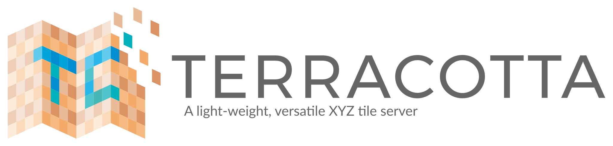
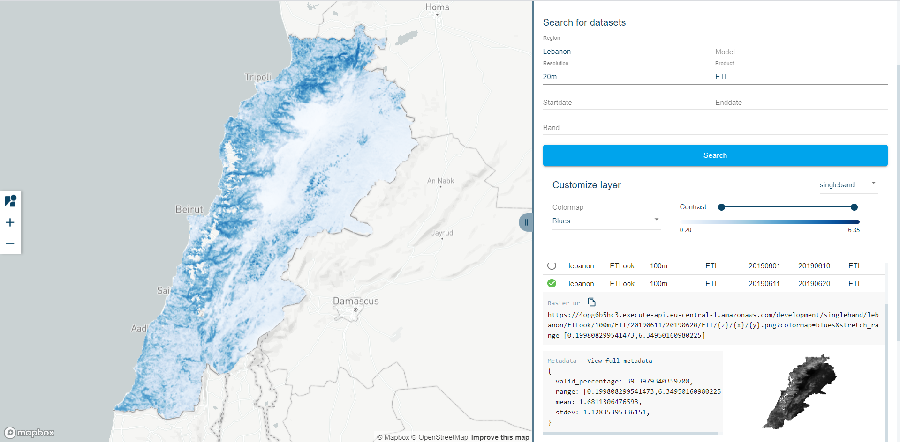

[](https://github.com/DHI-GRAS/terracotta/actions/workflows/test.yml)
[](https://terracotta-python.readthedocs.io/en/latest/?badge=latest)
[](https://codecov.io/gh/DHI-GRAS/terracotta)
[](https://github.com/DHI-GRAS/terracotta/releases)
[](https://pypi.org/project/terracotta)
[](https://github.com/DHI-GRAS/terracotta/blob/main/LICENSE)
[](https://pypi.org/project/terracotta)

[](#)

Terracotta is a pure Python tile server that runs as a WSGI app on a
dedicated webserver or as a serverless app on AWS Lambda. It is built on a
modern Python 3.6 stack, powered by awesome open-source software such as
[Flask](http://flask.pocoo.org), [Zappa](https://github.com/Miserlou/Zappa),
and [Rasterio](https://github.com/mapbox/rasterio).

[Read the docs](https://terracotta-python.readthedocs.io/en/latest) |
[Explore the API](https://2truhxo59g.execute-api.eu-central-1.amazonaws.com/production/apidoc) |
[Satlas, powered by Terracotta](http://satlas.dk)

## Why Terracotta?

- It is trivial to get going. Got a folder full of
  [cloud-optimized GeoTiffs](https://www.cogeo.org/) in different
  projections you want to have a look at in your browser?
  `terracotta serve -r {name}.tif` and
  `terracotta connect localhost:5000` get you there.
- We make minimal assumptions about your data, so *you stay in charge*.
  Keep using the tools you know and love to create and organize your
  data, Terracotta serves it exactly as it is.
- Serverless deployment is a first-priority use case, so you don’t have
  to worry about maintaining or scaling your architecture.
- Terracotta instances are self-documenting. Everything the frontend
  needs to know about your data is accessible from only a handful of
  API endpoints.

## The Terracotta workflow

### 1. Optimize raster files

```bash
$ ls -lh
total 1.4G
-rw-r--r-- 1 dimh 1049089 231M Aug 29 16:45 S2A_20160724_135032_27XVB_B02.tif
-rw-r--r-- 1 dimh 1049089 231M Aug 29 16:45 S2A_20160724_135032_27XVB_B03.tif
-rw-r--r-- 1 dimh 1049089 231M Aug 29 16:46 S2A_20160724_135032_27XVB_B04.tif
-rw-r--r-- 1 dimh 1049089 231M Aug 29 16:56 S2A_20170831_171901_25XEL_B02.tif
-rw-r--r-- 1 dimh 1049089 231M Aug 29 16:57 S2A_20170831_171901_25XEL_B03.tif
-rw-r--r-- 1 dimh 1049089 231M Aug 29 16:57 S2A_20170831_171901_25XEL_B04.tif

$ terracotta optimize-rasters *.tif -o optimized/

Optimizing rasters: 100%|██████████████████████████| [05:16<00:00, file=S2A_20170831_...25XEL_B04.tif]
```

### 2. Create a database from file name pattern

```bash
$ terracotta ingest optimized/S2A_{date}_{}_{tile}_{band}.tif -o greenland.sqlite
Ingesting raster files: 100%|███████████████████████████████████████████| 6/6 [00:49<00:00,  8.54s/it]
```

### 3. Serve it up

```bash
$ terracotta serve -d greenland.sqlite
 * Serving Flask app "terracotta.server" (lazy loading)
 * Environment: production
   WARNING: Do not use the development server in a production environment.
   Use a production WSGI server instead.
 * Debug mode: off
 * Running on http://localhost:5000/ (Press CTRL+C to quit)
```

### 4. Explore the running server

#### Manually

You can use any HTTP-capable client, such as `curl`.
```bash
$ curl localhost:5000/datasets?tile=25XEL
{"page":0,"limit":100,"datasets":[{"date":"20170831","tile":"25XEL","band":"B02"},{"date":"20170831","tile":"25XEL","band":"B03"},{"date":"20170831","tile":"25XEL","band":"B04"}]}
```

Modern browsers (e.g. Chrome or Firefox) will render the JSON as a tree.

#### Interactively

Terracotta also includes a web client. You can start the client (assuming the server is running at http://localhost:5000) using
```bash
$ terracotta connect localhost:5000
 * Serving Flask app "terracotta.client" (lazy loading)
 * Environment: production
   WARNING: Do not use the development server in a production environment.
   Use a production WSGI server instead.
 * Debug mode: off
 * Running on http://127.0.0.1:5100/ (Press CTRL+C to quit)
```

Then open the client page (http://127.0.0.1:5100/ in this case) in your browser.



## Development

We gladly accept [bug reports](https://github.com/DHI-GRAS/terracotta/issues)
and [pull requests](https://github.com/DHI-GRAS/terracotta/pulls) via GitHub.
For your code to be useful, make sure that it is covered by tests and that
it satisfies our linting practices (via `mypy` and `flake8`).

To run the tests, just install the necessary dependencies via

```bash
$ pip install -e .[test]
```

Then, you can run

```bash
$ pytest
```

from the root of the repository.
