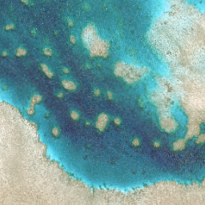
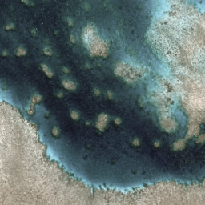

Performing color correction
===========================

Terracotta provides native integration with all transforms supported by the `color-operations <https://github.com/vincentsarago/color-operations>`_ Python package, such as gamma correction, sigmoidal contrast enhancement, and more.

To this end, the ``/singleband`` and ``/rgb`` endpoints accept a ``color_transform`` query parameter, which is expected to be a string that can be parsed by color-operations. For example, to apply a gamma correction with a gamma value of 2.2 to a single-band image, you can use the following URL:

.. code:: bash

    $ curl "http://localhost:8000/singleband/mykey/preview.png?color_transform=gamma 1 2.2"

Some example color transforms:

    

+-----------------+-----------------+
| |ct1|           | |ct2|           |
|                 |                 |
| Normal          | gamma rgb 0.6   |
+-----------------+-----------------+
| |ct3|           | |ct4|           |
|                 |                 |
| gamma rgb 1.8   | saturation 0.5  |
+-----------------+-----------------+
| |ct5|           |                 |
|                 |                 |
| saturation 1.2  |                 |
+-----------------+-----------------+

For a full list of available color transforms, please refer to the `color-operations README <https://github.com/vincentsarago/color-operations>`_.